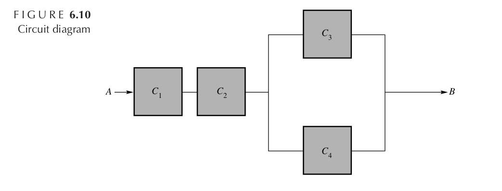

If $Y$ denotes the length of life of a component and $F(y)$ is the distribution function of $Y$, then $P(Y > y) = 1 - F(y)$ is called the _reliability_ of the component.
Suppose that a system consists of four components with identical reliability functions, $1 - F(y)$, operating as indicated in Figure 6.10.
The system operates correctly if an unbroken chain of components is in operation between $A$ and $B$.
If the four components operate independently, find the reliability of the system in terms of $F(y)$.

