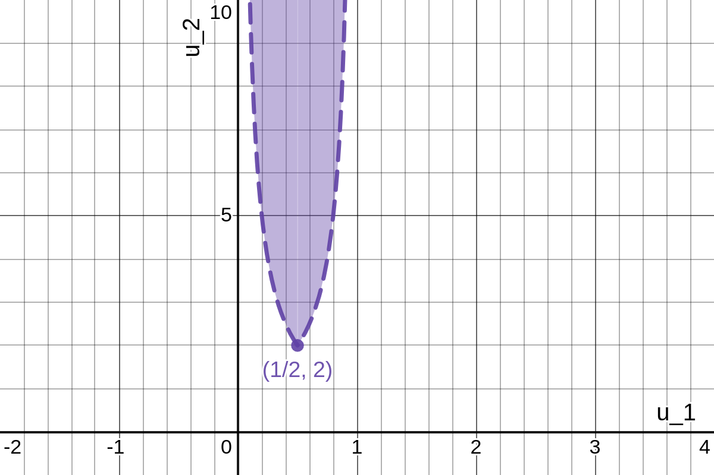

a) As seen previously, we can let $(h_1(y_1, y_2), h_2(y_1, y_2)) = (y_1 / (y_1 + y_2), y_1 + y_2) = (u_1, u_2)$, which will be a one-to-one transformation with inverse $(h_1^{-1}(u_1, u_2), h_2^{-1}(u_1, u_2)) = (u_1 u_2, u_2 (1 - u_1)) = (y_1, y_2)$ and Jacobian $J = u_2$.
Thus,

$$
\begin{align*}
    f_{U_1, U_2}(u_1, u_2) & = f_{Y_1, Y_2}(h_1^{-1}(u_1, u_2), h_2^{-1}(u_1, u_2)) |J|\\
    & = |u_2| \cdot
    \begin{cases}
        \frac{1}{(u_1 u_2)^2 (u_2 (1 - u_1))^2}, & 1 < u_1 u_2, 1 < u_2 (1 - u_1),\\
        0, & \text{elsewhere,}
    \end{cases}\\
    & =
    \begin{cases}
        \frac{1}{u_1^2 (1 - u_1)^2 u_2^3}, & 1 < u_1 u_2, 1 < u_2 (1 - u_1),\\
        0, & \text{elsewhere.}
    \end{cases}
\end{align*}
$$

---

b) We need $1 < u_1 u_2$ and $1 < u_2 (1 - u_1)$ both satisfied simultaneously.
This involves a lot of considerations, so let's examine $1 < u_2 \cdot v$ where $v = u_1$ or $v = 1 - u_1$.
To begin with, if $0 < u_2$, we can see that $1 < u_1 u_2$ will force $u_1 < 0$, and that $1 < u_2 (1 - u_1)$ will force $1 - u_1 < 0$, or $1 < u_1$.
But we cannot have both $u_1 < 0$ and $1 < u_1$, as this is a contradiction, so we simply rule out $u_2 < 0$ as a possibility.
Moving on to the case of $0 < u_2$, we can see that $1 < u_1 u_2$ forces $0 < u_1$, and $1 < u_2 (1 - u_1)$ forces $0 < 1 - u_1$.
Both of these together yields $0 < u_1 < 1$.
In such the case that $0 < u_2$, the inequality $1 < u_2 \cdot v$ satisfies both our initial inequalities precisely when $v = \max(u_1, 1 - u_1)$, which will always be positive because of the reasoning in the previous sentences.
So

$$
\begin{align*}
    \max(u_1, 1 - u_1) = u_1 & \Longleftrightarrow 1 - u_1 \leq u_1 \Longleftrightarrow 1 \leq 2u_1 \Longleftrightarrow \frac{1}{2} \leq u_1\\
    \text{and } \max(u_1, 1 - u_1) = 1 - u_1 & \Longleftrightarrow u_1 \leq 1 - u_1 \Longleftrightarrow 2u_1 \leq 1 \Longleftrightarrow u_1 \leq \frac{1}{2}.
\end{align*}
$$

(Note that $u_1 = 1 - u_1$ when $u_1 = 1 / 2$.)
Thus, when $0 < u_1 < 1 / 2$, we have $\max(u_1, 1 - u_1) = 1 - u_1$, and both initial inequalities, $1 < u_1 u_2$ and $1 < u_2 (1 - u_1)$, are simultaneously satisfied by solely $1 < u_2 (1 - u_1)$, or, equivalently, $1 / (1 - u_1) < u_2$.
And when $1 / 2 \leq u_1 < 1$, we have $\max(u_1, 1 - u_1) = u_1$, and both inequalities are simultaneously satisfied by solely $1 < u_1 u_2$, or, equivalently, $1 / u_1 < u_2$.
Wrapping this all up together neatly, we have shown exactly that

$$
\begin{align*}
    f_{U_1, U_2}(u_1, u_2) & =
    \begin{cases}
        \frac{1}{u_1^2 (1 - u_1)^2 u_2^3}, & 1 < u_1 u_2, 1 < u_2 (1 - u_1),\\
        0, & \text{elsewhere,}
    \end{cases}\\
    & =
    \begin{cases}
        \frac{1}{u_1^2 (1 - u_1)^2 u_2^3}, & 1 / u_1 < u_2, 0 < u_1 < 1 / 2 \text{ and}\\
        & 1 / (1 - u_1) < u_2, 1 / 2 \leq u_1 < 1,\\
        0, & \text{elsewhere.}
    \end{cases}
\end{align*}
$$

---

c)

This is the region described

$$
\left\{(u_1, u_2) \mid 0 < u_1 < \frac{1}{2} \text{ and } \frac{1}{u_1} < u_2 \right\} \bigcup \left\{(u_1, u_2) \mid \frac{1}{2} \leq u_1 < 1 \text{ and } \frac{1}{1 - u_1} < u_2 \right\}.
$$

For reference, the left side of the region is a segment of the curve $u_2 = \frac{1}{u_1}$, while the right side is a segment of the curve $u_2 = \frac{1}{1 - u_1}$.
The curves meet at $u_2 = 2 = \frac{1}{(1 / 2)} = \frac{1}{1 - (1 / 2)}$, when $u_1 = \frac{1}{2}$.

---

d)

$$
\begin{align*}
    f_{U_1}(u_1) & =
    \begin{cases}
        \int_{u_2 = 1 / u_1}^{u_2 = \infty} \frac{1}{u_1^2 (1 - u_1)^2 u_2^3} du_2\\
        = -\frac{1}{2u_1^2 (1 - u_1)^2 u_2^2} \biggr|_{u_2 = 1 / u_1}^{u_2 = \infty}\\
        = 0 + \frac{1}{2u_1^2 (1 - u_1)^2 (1 / u_1)^2}\\
        = \frac{1}{2(1 - u_1)^2}, & 0 < u_1 < \frac{1}{2},\\
        \int_{u_2 = 1 / (1 - u_1)}^{u_2 = \infty} \frac{1}{u_1^2 (1 - u_1)^2 u_2^3} du_2\\
        = -\frac{1}{2u_1^2 (1 - u_1)^2 u_2^2} \biggr|_{u_2 = 1 / (1 - u_1)}^{u_2 = \infty}\\
        = 0 + \frac{1}{2u_1^2 (1 - u_1)^2 [1 / (1 - u_1)]^2}\\
        = \frac{1}{2u_1^2}, & \frac{1}{2} \leq u_1 < 1,\\
        0, & \text{elsewhere}
    \end{cases}
\end{align*}
$$

---

e) Simply notice that the support of $f_{U_1, U_2}$ is non-rectangular, so $U_1$ and $U_2$ are independent.
For masochists who require more detail:

Since $0 < u_1$ and $0 < u_2$, we will also have

$$
\begin{align*}
    1 < u_1 u_2 & \Longleftrightarrow \frac{1}{u_2} < u_1\\
    \text{and } 1 < u_2 (1 - u_1) & \Longleftrightarrow 1 < u_2 - u_1 u_2 \Longleftrightarrow u_1 u_2 < u_2 - 1 \Longleftrightarrow u_1 < \frac{u_2 - 1}{u_2}
\end{align*}
$$

as our bounds of integration in $f_{U_2}(u_2)$.
As for the form of the support of $f_{U_2}(u_2)$, for the subregion $1 / u_1 < u_2, 0 < u_1 < 1 / 2$, as $u_1$ ranges between $0$ and $1 / 2$, $u_2$ will range between $2$ and $\infty$.
Similarly for the subregion $1 / (1 - u_1) < u_2, 1 / 2 \leq u_1 < 1$, as $u_1$ ranges between $1 / 2$ and $1$, $u_2$ will continue to range between $2$ and $\infty$.
Thus, the support of $f_{U_2}(u_2)$ will be $2 \leq u_2 < \infty$.
In pursuit of ultimately finding $f_{U_2}(u_2)$, let us evaluate the integral

$$
\int_{u_1 = 1 / u_2}^{u_1 = (u_2 - 1) / u_2} \frac{1}{u_1^2 (1 - u_1)^2 u_2^3} du_1 = \frac{1}{u_2^3} \int_{u_1 = 1 / u_2}^{u_1 = (u_2 - 1) / u_2} \frac{1}{u_1^2 (1 - u_1)^2} du_1
$$

using partial fraction decomposition.
Let's write out that form of the integrand first:

$$
\begin{align*}
    \frac{1}{u_1^2 (1 - u_1)^2} & = \frac{A}{u_1} + \frac{B}{u_1^2} + \frac{C}{1 - u_1} + \frac{D}{(1 - u_1)^2}\\
    & = \frac{Au_1 (1 - u_1)^2 + B(1 - u_1)^2 + Cu_1^2 (1 - u_1) + Du_1^2}{u_1^2 (1 - u_1)^2}\\
    \implies 1 & = Au_1 (1 - u_1)^2 + B(1 - u_1)^2 + Cu_1^2 (1 - u_1) + Du_1^2\\
    & = A(u_1^3 - 2u_1^2 + u_1) + B(u_1^2 - 2u_1 + 1) + C(u_1^2 - u_1^3) + D(u_1^2)\\
    & = (A - C)u_1^3 + (-2A + B + C + D)u_1^2 + (A - 2B)u_1 + (B)\\
    \implies 0 & = (1)A + (0)B + (-1)C + (0)D\\
    0 & = (-2)A + (1)B + (1)C + (1)D\\
    0 & = (1)A + (-2)B + (0)C + (0)D\\
    1 & = (0)A + (1)B + (0)C + (0)D\\
    \longrightarrow & \left[
    \begin{array}{cccc:c}
        1 & 0 & -1 & 0 & 0\\
        -2 & 1 & 1 & 1 & 0\\
        1 & -2 & 0 & 0 & 0\\
        0 & 1 & 0 & 0 & 1
    \end{array} \right] \quad (\text{the system's matrix form})\\
    \xrightarrow{RREF} & \left[
    \begin{array}{cccc:c}
        1 & 0 & 0 & 0 & 2\\
        0 & 1 & 0 & 0 & 1\\
        0 & 0 & 1 & 0 & 2\\
        0 & 0 & 0 & 1 & 1
    \end{array} \right]\\
    \implies & A = 2, B = 1, C = 2, D = 1\\
    \implies \frac{1}{u_1^2 (1 - u_1)^2} & = \frac{2}{u_1} + \frac{1}{u_1^2} + \frac{2}{1 - u_1} + \frac{1}{(1 - u_1)^2}
\end{align*}
$$

We will then have

$$
\begin{align*}
    & \frac{1}{u_2^3} \int_{u_1 = 1 / u_2}^{u_1 = (u_2 - 1) / u_2} \frac{1}{u_1^2 (1 - u_1)^2} du_1\\
    & = \frac{1}{u_2^3} \int_{u_1 = 1 / u_2}^{u_1 = (u_2 - 1) / u_2} \left(\frac{2}{u_1} + \frac{1}{u_1^2} + \frac{2}{1 - u_1} + \frac{1}{(1 - u_1)^2} \right) du_1\\
    & = \frac{1}{u_2^3} \left[2 \ln(|u_1|) - \frac{1}{u_1} - 2 \ln(|1 - u_1|) + \frac{1}{1 - u_1} \right]_{u_1 = 1 / u_2}^{u_1 = (u_2 - 1) / u_2}\\
    & = \frac{1}{u_2^3} \left[2 \ln \left( \left|\frac{u_2 - 1}{u_2} \right| \right) - \frac{1}{(u_2 - 1) / u_2} - 2 \ln \left( \left|1 - \frac{u_2 - 1}{u_2} \right| \right) + \frac{1}{1 - (u_2 - 1) / u_2} \right]\\
    & - \frac{1}{u_2^3} \left[2 \ln \left( \left|\frac{1}{u_2} \right| \right) - \frac{1}{1 / u_2} - 2 \ln \left( \left|1 - \frac{1}{u_2} \right| \right) + \frac{1}{1 - 1 / u_2} \right]\\
    & = \frac{1}{u_2^3} \left[2 \ln \left( \left|\frac{u_2 - 1}{u_2} \right| \right) - \frac{u_2}{u_2 - 1} - 2 \ln \left( \left|\frac{1}{u_2} \right| \right) + u_2 \right]\\
    & - \frac{1}{u_2^3} \left[2 \ln \left( \left|\frac{1}{u_2} \right| \right) - u_2 - 2 \ln \left( \left|\frac{u_2 - 1}{u_2} \right| \right) + \frac{u_2}{u_2 - 1} \right]\\
    & = \frac{1}{u_2^3} \left[4 \ln \left(\left|\frac{u_2 - 1}{u_2} \right| \right) - \frac{2u_2}{u_2 - 1} - 4 \ln \left(\left|\frac{1}{u_2} \right| \right) + 2u_2 \right]\\
    & = \frac{1}{u_2^3} \left[4 \ln(|u_2 - 1|) - 4 \ln(|u_2|) - \frac{2u_2}{u_2 - 1} - 4(\ln(|1|) - \ln(|u_2|)) + 2u_2 \right]\\
    & = \frac{1}{u_2^3} \left[4 \ln(|u_2 - 1|) - \frac{2u_2}{u_2 - 1} + 2u_2 \right]\\
    & = \frac{4 \ln(|u_2 - 1|)}{u_2^3} + \frac{2}{u_2^2 (1 - u_2)} + \frac{2}{u_2^2}\\
    \implies & f_{U_2}(u_2) =
    \begin{cases}
       \int_{u_1 = 1 / u_2}^{u_1 = (u_2 - 1) / u_2} \frac{1}{u_1^2 (1 - u_1)^2 u_2^3} du_1\\
       = \frac{4 \ln(|u_2 - 1|)}{u_2^3} + \frac{2}{u_2^2 (1 - u_2)} + \frac{2}{u_2^2}, & 2 \leq u_2,\\
       0, & \text{elsewhere}
    \end{cases}\\
    \implies & f_{U_1}(u_2) f_{U_2}(u_2) =
    \begin{cases}
       \frac{1}{2(1 - u_1)^2}, & 0 < u_1 < \frac{1}{2},\\
       \frac{1}{2u_1^2}, & \frac{1}{2} \leq u_1 < 1,\\
       0, & \text{elsewhere}
    \end{cases} \cdot
    \begin{cases}
        \frac{4 \ln(u_2 - 1)}{u_2^3} + \frac{2}{u_2^2 (1 - u_2)} + \frac{2}{u_2^2}, & 2 \leq u_2,\\
        0, & \text{elsewhere}
    \end{cases}\\
    & =
    \begin{cases}
        \frac{2 \ln(u_2 - 1)}{(1 - u_1)^2 u_2^3} + \frac{1}{(1 - u_1)^2 u_2^2 (1 - u_2)} + \frac{1}{(1 - u_1)^2 u_2^2}, & 0 < u_1 < \frac{1}{2}, 2 \leq u_2,\\
        \frac{2 \ln(u_2 - 1)}{u_1^2 u_2^3} + \frac{1}{u_1^2 u_2^2 (1 - u_2)} + \frac{1}{u_1^2 u_2^2}, & \frac{1}{2} \leq u_1 < 1, 2 \leq u_2,\\
        0, & \text{elsewhere}
    \end{cases}\\
    & \neq f_{U_1, U_2}(u_1, u_2).
\end{align*}
$$

Therefore, $U_1$ and $U_2$ are not independent.
