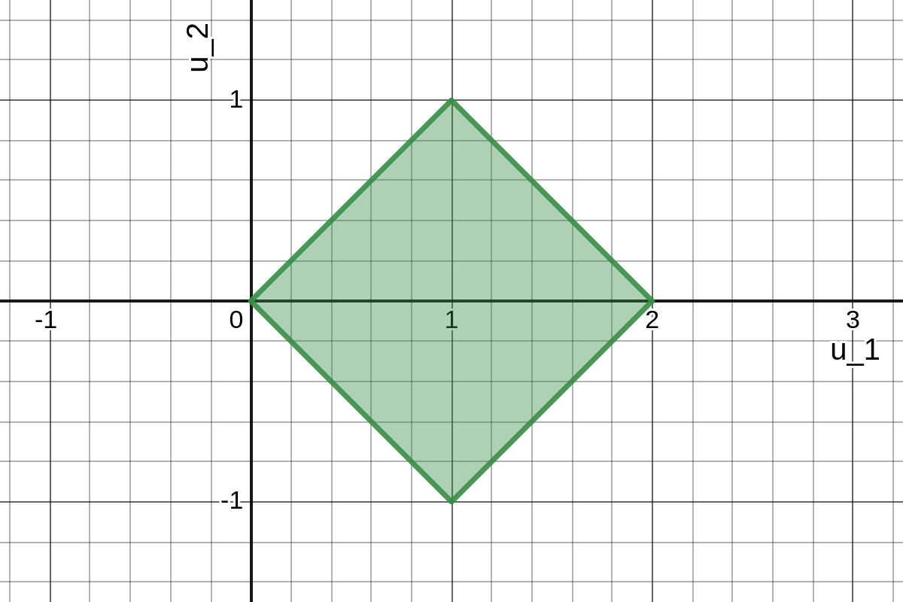

a) First note that

$$
f_{Y_1, Y_2}(y_1, y_2) =
\begin{cases}
    1, & 0 \leq u_1 \leq 1, 0 \leq u_2 \leq 1,\\
    0, & \text{elsewhere.}
\end{cases}
$$

Let $h(y_1, y_2) = (h_1(y_1, y_2), h_2(y_1, y_2)) = (y_1 + y_2, y_1 - y_2) = (u_1, u_2)$.
Suppose $h(v_1, v_2) = h(w_1, w_2)$ for some $(v_1, v_2), (w_1, w_2) \in \text{supp}(f_{Y_1, Y_2})$.
Then

$$
\begin{align*}
    h(v_1, v_2) = h(w_1, w_2) & \Longleftrightarrow (v_1 + v_2, v_1 - v_2) = (w_1 + w_2, w_1 - w_2)\\
    & \Longleftrightarrow (v_1 + v_2 + (v_1 - v_2), v_1 - v_2) = (w_1 + w_2 + (v_1 - v_2), w_1 - w_2)\\
    & \Longleftrightarrow (2v_1, v_1 - v_2) = (w_1 + w_2 + (w_1 - w_2), w_1 - w_2)\\
    & \Longleftrightarrow (2v_1, v_1 - v_2) = (2w_1, w_1 - w_2)\\
    & \Longleftrightarrow (2v_1, v_1 - v_2 - (v_1 + v_2)) = (2w_1, w_1 - w_2 - (v_1 + v_2))\\
    & \Longleftrightarrow (2v_1, -2v_2) = (2w_1, w_1 - w_2 + (w_1 + w_2))\\
    & \Longleftrightarrow (2v_1, -2v_2) = (2w_1, -2w_2)\\
    & \Longleftrightarrow (2v_1 \cdot (1/2), -2v_2 \cdot (-1/2)) = (2w_1 \cdot (1/2), -2w_2 \cdot (-1/2))\\
    & \Longleftrightarrow (v_1, v_2) = (w_1, w_2).
\end{align*}
$$

Thus, $h$ is one-to-one.
The inverse $h^{-1}$ will then be

$$
\begin{align*}
    h^{-1}(u_1, u_2) & = (h_1^{-1}(u_1, u_2), h_2^{-1}(u_1, u_2))\\
    & = \left(\frac{u_1 + u_2}{2}, \frac{u_1 - u_2}{2} \right)\\
    & = \left(\frac{(y_1 + y_2) + (y_1 - y_2)}{2}, \frac{(y_1 + y_2) - (y_1 - y_2)}{2} \right)\\
    & = \left(\frac{2y_1}{2}, \frac{2y_2}{2} \right)\\
    & = (y_1, y_2).
\end{align*}
$$

The Jacobian of $h$ will be

$$
J = \det
\begin{bmatrix}
    \frac{\partial h_1^{-1}}{\partial u_1} & \frac{\partial h_1^{-1}}{\partial u_2}\\
    \frac{\partial h_2^{-1}}{\partial u_1} & \frac{\partial h_2^{-1}}{\partial u_2}
\end{bmatrix} = \det
\begin{bmatrix}
    \frac{1}{2} & \frac{1}{2}\\
    \frac{1}{2} & -\frac{1}{2}
\end{bmatrix} = \left(\frac{1}{2} \right)\left(-\frac{1}{2} \right) - \left(\frac{1}{2} \right) \left(\frac{1}{2} \right) = -\frac{1}{2}.
$$

Thus,

$$
\begin{align*}
    f_{U_1, U_2}(u_1, u_2) & = f_{Y_1, Y_2}(h_1^{-1}(u_1, u_2), h_2^{-1}(u_1, u_2)) |J|\\
    & =
    \begin{cases}
        \frac{1}{2}, & 0 \leq \frac{u_1 + u_2}{2} \leq 1, 0 \leq \frac{u_1 - u_2}{2} \leq 1,\\
        0, & \text{elsewhere.}
    \end{cases}
\end{align*}
$$

To find the bounds of $u_1$, we can solve each of $0 \leq \frac{u_1 + u_2}{2} \leq 1$ and $0 \leq \frac{u_1 - u_2}{2} \leq 1$ for

$$
-u_2 \leq u_1 \leq 2 - u_2 \quad \text{ and } \quad u_2 \leq u_1 \leq u_2 + 2
$$

and then add these latter two inequalities together to get

$$
\begin{align*}
    & (-u_2) + (u_2) \leq (u_1) + (u_1) \leq (2 - u_2) + (u_2 + 2)\\
    & \Longleftrightarrow 0 \leq 2u_1 \leq 4 \Longleftrightarrow 0 \leq u_1 \leq 2.
\end{align*}
$$

Now solving $0 \leq \frac{u_1 + u_2}{2} \leq 1$ and $0 \leq \frac{u_1 - u_2}{2} \leq 1$ to bound $u_2$ yields

$$
-u_1 \leq u_2 \leq 2 - u_1 \quad \text{ and } \quad u_1 - 2 \leq u_2 \leq u_1.
$$

Since $u_2$ must be greater than or equal to both $-u_1$ and $u_1 - 2$ simultaneously, we will have $\max(-u_1, u_1 - 2) \leq u_2$.
Keeping in mind that we also have $0 \leq u_1 \leq 2$, we can find when $\max(-u_1, u_1 - 2) = -u_1$ and when $\max(-u_1, u_1 - 2) = u_1 - 2$.
If $\max(-u_1, u_1 - 2) = -u_1$, then $u_1 - 2 \leq -u_1 \Longleftrightarrow 2u_1 \leq 2 \Longleftrightarrow u_1 \leq 1$.
If $\max(-u_1, u_1 - 2) = u_1 - 2$, then $-u_1 \leq u_1 - 2 \Longleftrightarrow 2 \leq 2u_1 \Longleftrightarrow 1 \leq u_1$.
Additionally, since $u_2$ must be less than or equal to both $2 - u_1$ and $u_1$ simultaneously, we will have $u_2 \leq \min(2 - u_1, u_1)$.
If $\min(2 - u_1, u_1) = 2 - u_1$, then $2 - u_1 \leq u_1 \Longleftrightarrow 2 \leq 2u_1 \Longleftrightarrow 1 \leq u_1$.
If $\min(2 - u_1, u_1) = u_1$, then $u_1 \leq 2 - u_1 \Longleftrightarrow 2u_1 \leq 2 \Longleftrightarrow u_1 \leq 1$.
Putting this all together, we can re-express the joint density $f_{U_1, U_2}$ as

$$
\begin{align*}
    f_{U_1, U_2}(u_1, u_2) & =
    \begin{cases}
        \frac{1}{2}, & 0 \leq \frac{u_1 + u_2}{2} \leq 1, 0 \leq \frac{u_1 - u_2}{2} \leq 1,\\
        0, & \text{elsewhere.}
    \end{cases}\\
    & =
    \begin{cases}
        \frac{1}{2}, & -u_1 \leq u_2 \leq u_1, 0 \leq u_1 \leq 1 \text{ and}\\
        & u_1 - 2 \leq u_2 \leq 2 - u_1, 1 \leq u_1 \leq 2,\\
        0, & \text{elsewhere.}
    \end{cases}
\end{align*}
$$

---

b) 

For reference, the upper left edge of this tilted square/diamond is a segment of the line $u_2 = u_1$, and the lower left edge is a segment of the line $u_2 = -u_1$, and both of these extend over the interval $0 \leq u_1 \leq 1$.
Over the interval $1 \leq u_1 \leq 2$, the upper right edge is a segment of the line $u_2 = 2 - u_1$ and the lower right edge is a segment of the line $u_2 = u_1 - 2$.

---

c)

$$
f_{U_1}(u_1) =
\begin{cases}
    \int_{u_2 = -u_1}^{u_2 = u_1} \frac{1}{2} du_2\\
    = \frac{1}{2} u_2 \biggr|_{u_2 = -u_1}^{u_2 = u_1}\\
    = \frac{1}{2} (u_1) - \frac{1}{2} (-u_1)\\
    = u_1, & 0 \leq u_1 \leq 1,\\
    \int_{u_2 = u_1 - 2}^{u_2 = 2 - u_1} \frac{1}{2} du_2\\
    = \frac{1}{2} u_2 \biggr|_{u_2 = u_1 - 2}^{u_2 = 2 - u_1}\\
    = \frac{1}{2} (2 - u_1) - \frac{1}{2} (u_1 - 2)\\
    = 2 - u_1, & 1 \leq u_1 \leq 2,\\
    0, & \text{elsewhere}
\end{cases}
$$

---

d) This involves examining the support of $f_{U_1, U_2}$ for bounds of integration and intervals of the piecewise function, both of which are straightforward enough:

$$
f_{U_2}(u_2) =
\begin{cases}
    \int_{u_1 = -u_2}^{u_1 = u_2 + 2} \frac{1}{2} du_1\\
    = \frac{1}{2} u_1 \biggr|_{u_1 = -u_2}^{u_1 = u_2 + 2}\\
    = \frac{1}{2} (u_2 + 2) - \frac{1}{2} (-u_2)\\
    = 1 + u_2, & -1 \leq u_2 \leq 0,\\
    \int_{u_1 = u_2}^{u_1 = 2 - u_2} \frac{1}{2} du_1\\
    = \frac{1}{2} u_1 \biggr|_{u_1 = u_2}^{u_1 = 2 - u_2}\\
    = \frac{1}{2} (2 - u_2) - \frac{1}{2} (u_2)\\
    = 1 - u_2, & 0 \leq u_2 \leq 1,\\
    0, & \text{elsewhere.}
\end{cases}
$$

---

e)

$$
\begin{align*}
    f_{U_1}(u_1) f_{U_2}(u_2) & =
    \begin{cases}
        u_1, & 0 \leq u_1 \leq 1,\\
        2 - u_1, & 1 \leq u_1 \leq 2,\\
        0, & \text{elsewhere}
    \end{cases} \cdot
    \begin{cases}
        1 + u_2, & -1 \leq u_2 \leq 0,\\
        1 - u_2, & 0 \leq u_2 \leq 1,\\
        0, & \text{elsewhere}
    \end{cases}\\
    & =
    \begin{cases}
        u_1 (1 + u_2), & 0 \leq u_1 \leq 1, -1 \leq u_2 \leq 0,\\
        u_1 (1 - u_2), & 0 \leq u_1 \leq 1, 0 \leq u_2 \leq 1,\\
        (2 - u_1)(1 + u_2), & 1 \leq u_1 \leq 2, -1 \leq u_2 \leq 0,\\
        (2 - u_1)(1 - u_2), & 1 \leq u_1 \leq 2, 0 \leq u_2 \leq 1,\\
        0, & \text{elsewhere}
    \end{cases}\\
    & \neq
    \begin{cases}
        \frac{1}{2}, & -u_1 \leq u_2 \leq u_1, 0 \leq u_1 \leq 1 \text{ and}\\
        & u_1 - 2 \leq u_2 \leq 2 - u_1, 1 \leq u_1 \leq 2,\\
        0, & \text{elsewhere}
    \end{cases}\\
    & = f_{U_1, U_2}(u_1, u_2)
\end{align*}
$$

Thus, $U_1$ and $U_2$ are not independent.
