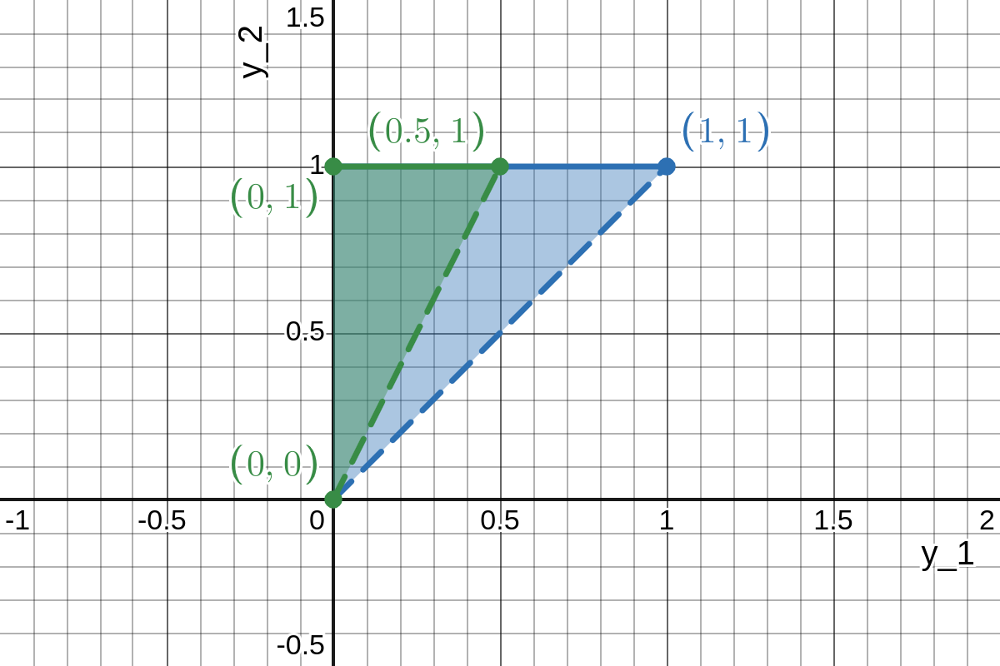

The first step here is to find the joint density function of $Y_{(1)}$ and $Y_{(2)}$:

$$
\begin{align*}
    g_{(1)(2)}(y_1, y_2) & = \frac{2!}{(1 - 1)! \, (2 - 1 - 1)! \, (2 - 2)!} [F(y_1)]^{1 - 1}\\
    & \times [F(y_2) - F(y_1)]^{2 - 1 - 1} [1 - F(y_2)]^{2 - 2} f(y_1) f(y_2)\\
    & = 2
    \begin{cases}
        1, & 0 \leq y_1 \leq 1,\\
        0, & \text{elsewhere}
    \end{cases} \cdot
    \begin{cases}
        1, & 0 \leq y_2 \leq 1,\\
        0, & \text{elsewhere}
    \end{cases} \quad -\infty < y_1 < y_2 < \infty\\
    & =
    \begin{cases}
        2, & 0 \leq y_1 < y_2 \leq 1,\\
        0, & \text{elsewhere.}
    \end{cases}
\end{align*}
$$

The image below shows a larger blue triangle, which is the support of the joint density found above, and a smaller green triangle, which is the intersection of that support and the region described by $2y_1 < y_2$.
It is over this smaller green triangle which we will integrate the joint density to find the desired probability.

$$
\begin{align*}
    P(2Y_{(1)} < Y_{(2)}) & = \int_{y_1 = 0}^{y_1 = 1 / 2} \int_{y_2 = 2y_1}^{y_2 = 1} 2 dy_2 dy_1\\
    & = \int_{y_1 = 0}^{y_1 = 1 / 2} 2y_2 \biggr|_{y_2 = 2y_1}^{y_2 = 1} dy_1\\
    & = \int_{y_1 = 0}^{y_1 = 1 / 2} \left[2(1) - 2(2y_1) \right] dy_1\\
    & = \int_{y_1 = 0}^{y_1 = 1 / 2} \left(2 - 4y_1 \right) dy_1\\
    & = \left[2y_1 - 2y_1^2 \right]_{y_1 = 0}^{y_1 = 1 / 2}\\
    & = \left(2 \left(\frac{1}{2} \right) - 2 \left(\frac{1}{2} \right)^2 \right) - \left(2(0) - 2(0)^2 \right)\\
    & = 1 - \frac{2}{4} = \frac{1}{2}
\end{align*}
$$
