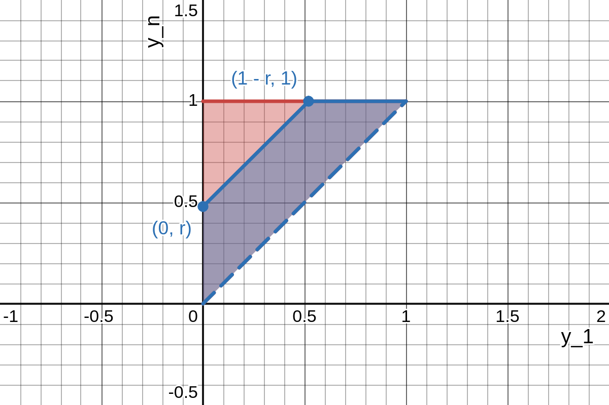

Considering $R$ as a function of $Y_{(1)}$ and $Y_{(n)}$, we can use the method of distribution functions to find the density of $R$.
To do this, we will first find the distribution function of $R$, i.e., $F(r) = P(R \leq r) = P(Y_{(n)} - Y_{(1)} \leq r) = P(Y_{(n)} \leq Y_{(1)} + r)$.
From here, we need the joint density function of $Y_{(1)}$ and $Y_{(n)}$, which we can find using Theorem 6.5:

$$
\begin{align*}
    f_{Y_{(1)}, Y_{(n)}}(y_1, y_n) & = \frac{n!}{(1 - 1)! \, (n - 1 - 1)! \, (n - n)!} [F(y_1)]^{1 - 1}\\
    & \times [F(y_n) - F(y_1)]^{n - 1 - 1} [1 - F(y_n)]^{n - n}\\
    & \times f(y_1) f(y_n), \quad -\infty < y_1 < y_n < \infty\\
    & = n(n - 1) \left[
    \begin{cases}
        0, & y_n < 0,\\
        y_n, & 0 \leq y_n \leq 1,\\
        1, & 1 < y_n
    \end{cases} -
    \begin{cases}
        0, & y_1 < 0,\\
        y_1, & 0 \leq y_1 \leq 1,\\
        1, & 1 < y_1
    \end{cases} \right]^{n - 2}\\
    & \times
    \begin{cases}
        1, & 0 \leq y_1 \leq 1,\\
        0, & \text{elsewhere}
    \end{cases} \cdot
    \begin{cases}
        1, & 0 \leq y_n \leq 1,\\
        0, & \text{elsewhere}
    \end{cases}, \quad -\infty < y_1 < y_n < \infty\\
    & =
    \begin{cases}
        n(n - 1)(y_n - y_1)^{n - 2}, & 0 \leq y_1 < y_n \leq 1,\\
        0, & \text{elsewhere.}
    \end{cases}
\end{align*}
$$

Next, we can find the region $R \leq r$, or, equivalently, $Y_{(n)} \leq Y_{(1)} + r$, in the $y_1 y_n$-plane:

The image above shows a large red triangle, which is the support of $f_{Y_{(1)}, Y_{(n)}}$, and a blue region within it, which is the intersection of the support and the region described by $y_n \leq y_1 + r$.
The two points are found by evaluating $y_n = y_1 + r$ at $0$ to get $0 + r = r$ and thus the point $(0, r)$, and by solving $y_1 + r = 1$ for $y_1 = 1 - r$, and thus the point $(1 - r, 1)$.
We can see that when $r = 0$, then this becomes $y_n \leq y_1 + r = y_1$, and the blue region vanishes.
And when $r = 1$ the blue region entirely covers the large red triangle because $(0, r) = (0, 1) = (1 - r, 1)$.
Hence, the support of $f_R$ will, in the end, be $0 \leq r \leq 1$.
Now to find $F_R$, noting that we can more easily integrate over the blue region by instead calculating one minus the integral over the support minus the blue region:

$$
\begin{align*}
    F_R(r) & =
    \begin{cases}
        0, & r < 0,\\
        1 - \int_{y_1 = 0}^{y_1 = 1 - r} \int_{y_n = y_1 + r}^{y_n = 1} n(n - 1)(y_n - y_1)^{n - 2} dy_n dy_1\\
        = 1 - \int_{y_1 = 0}^{y_1 = 1 - r} n(y_n - y_1)^{n - 1} \biggr|_{y_n = y_1 + r}^{y_n = 1} dy_1\\
        = 1 - \int_{y_1 = 0}^{y_1 = 1 - r} n \left[((1) - y_1)^{n - 1} - ((y_1 + r) - y_1)^{n - 1} \right] dy_1\\
        = 1 - \int_{y_1 = 0}^{y_1 = 1 - r} \left[n(1 - y_1)^{n - 1} - nr^{n - 1} \right] dy_1\\
        = 1 - \left[-(1 - y_1)^n - nr^{n - 1} y_1 \right]_{y_1 = 0}^{y_1 = 1 - r}\\
        = 1 - [\left(-(1 - (1 - r))^n - nr^{n - 1} (1 - r) \right)\\
         - \left(-(1 - (0))^n - nr^{n - 1} (0) \right)]\\
        = 1 - [-r^n - nr^{n - 1} (1 - r) + 1]\\
        = r^n + nr^{n - 1} (1 - r)\\
        = (1 - n)r^n + nr^{n - 1}, & 0 \leq r \leq 1,\\
        1, & 1 < r.
    \end{cases}
\end{align*}
$$

And now we can finally differentiate this to find our density function for the range $R = Y_{(n)} - Y_{(1)}$:

$$
f_R(r) =
\begin{cases}
    n(1 - n)r^{n - 1} + n(n - 1)r^{n - 2}\\
    = n(1 - n)r^{n - 1} - n(1 - n)r^{n - 2}\\
    = n(1 - n)r^{n - 2} (r - 1), & 0 \leq r \leq 1,\\
    0, & \text{elsewhere.}
\end{cases}
$$

There are other valid methods for finding this as well.
(See the standard solutions manual for a solution using the bivariate transformation method.)
