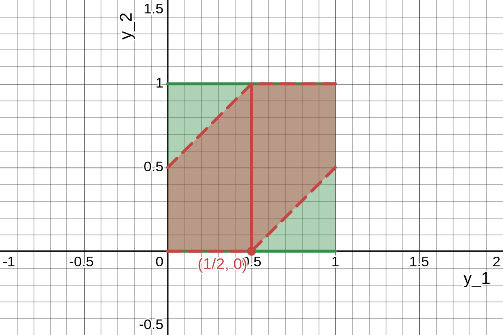

Let one end of the road be designated as point $0$ and the other by point $1$, so that distance along the road each sentry is assigned is uniformly distributed over $[0, 1]$.
Also let the point for sentry one be $Y_1$ and the point for the other be $Y_2$.
By independence,

$$
\begin{align*}
    f_{Y_1, Y_2}(y_1, y_2) & =
    \begin{cases}
        1, & 0 \leq y_1 \leq 1, 0 \leq y_2 \leq 1,\\
        0, & \text{elsewhere}
    \end{cases}\\
    \implies P \left(|Y_2 - Y_1| < \frac{1}{2} \right) & = P \left(-\frac{1}{2} < Y_2 - Y_1 < \frac{1}{2} \right)\\
    & = P \left(Y_1 - \frac{1}{2} < Y_2 < Y_1 + \frac{1}{2} \right).
\end{align*}
$$

The image below shows a green unit square, the support of $f_{Y_1, Y_2}$, and a red region divided into two subregions, which is the intersection of the support and the region described by $y_1 - \frac{1}{2} < y_2 < y_1 + \frac{1}{2}$.
The top left diagonal line demarcating the red region is a segment of the line $y_2 = y_1 + \frac{1}{2}$, and the bottom left one $y_2 = y_1 - \frac{1}{2}$.
The vertical red line subdividing the red region into two subregions is at $y_1 = \frac{1}{2}$.

Thus,

$$
\begin{align*}
    P \left(|Y_2 - Y_1| < \frac{1}{2} \right) & = P \left(Y_1 - \frac{1}{2} < Y_2 < Y_1 + \frac{1}{2} \right)\\
    & = \int_{y_1 = 0}^{y_1 = 1 / 2} \int_{y_2 = 0}^{y_2 = y_1 + 1 / 2} 1 dy_2 dy_1 + \int_{y_1 = 1 / 2}^{y_1 = 1} \int_{y_2 = y_1 - 1 / 2}^{y_2 = 1} 1 dy_2 dy_1\\
    & = \int_{y_1 = 0}^{y_1 = 1 / 2} y_2 \biggr|_{y_2 = 0}^{y_2 = y_1 + 1 / 2} dy_1 + \int_{y_1 = 1 / 2}^{y_1 = 1} y_2 \biggr|_{y_2 = y_1 - 1 / 2}^{y_2 = 1} dy_1\\
    & = \int_{y_1 = 0}^{y_1 = 1 / 2} [(y_1 + (1 / 2)) - (0)] dy_1 + \int_{y_1 = 1 / 2}^{y_1 = 1} [(1) - (y_1 - (1 / 2))] dy_1\\
    & = \int_{y_1 = 0}^{y_1 = 1 / 2} \left(y_1 + \frac{1}{2} \right) dy_1 + \int_{y_1 = 1 / 2}^{y_1 = 1} \left(\frac{3}{2} - y_1 \right) dy_1\\
    & = \left[\frac{1}{2} y_1^2 + \frac{1}{2} y_1 \right]_{y_1 = 0}^{y_1 = 1 / 2} + \left[\frac{3}{2} y_1 - \frac{1}{2} y_1^2 \right]_{y_1 = 1 / 2}^{y_1 = 1}\\
    & = \left[\left(\frac{1}{2} \left(\frac{1}{2} \right)^2 + \frac{1}{2} \left(\frac{1}{2} \right) \right) - \left(\frac{1}{2} (0)^2 + \frac{1}{2} (0) \right) \right]\\
    &  + \left[\left(\frac{3}{2} (1) - \frac{1}{2} (1)^2 \right) - \left(\frac{3}{2} \left(\frac{1}{2} \right) - \frac{1}{2} \left(\frac{1}{2} \right)^2 \right) \right]\\
    & = \frac{1}{8} + \frac{1}{4} + \frac{3}{2} - \frac{1}{2} - \frac{3}{4} + \frac{1}{8} = \frac{6}{8} = \frac{3}{4}.
\end{align*}
$$
